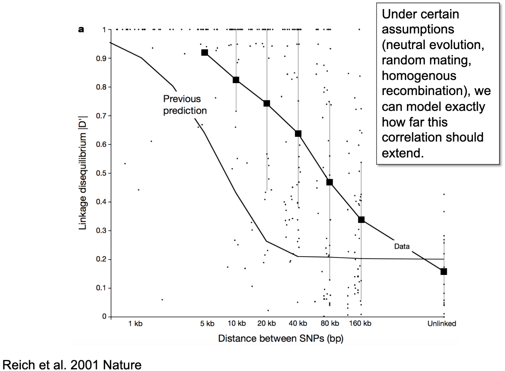
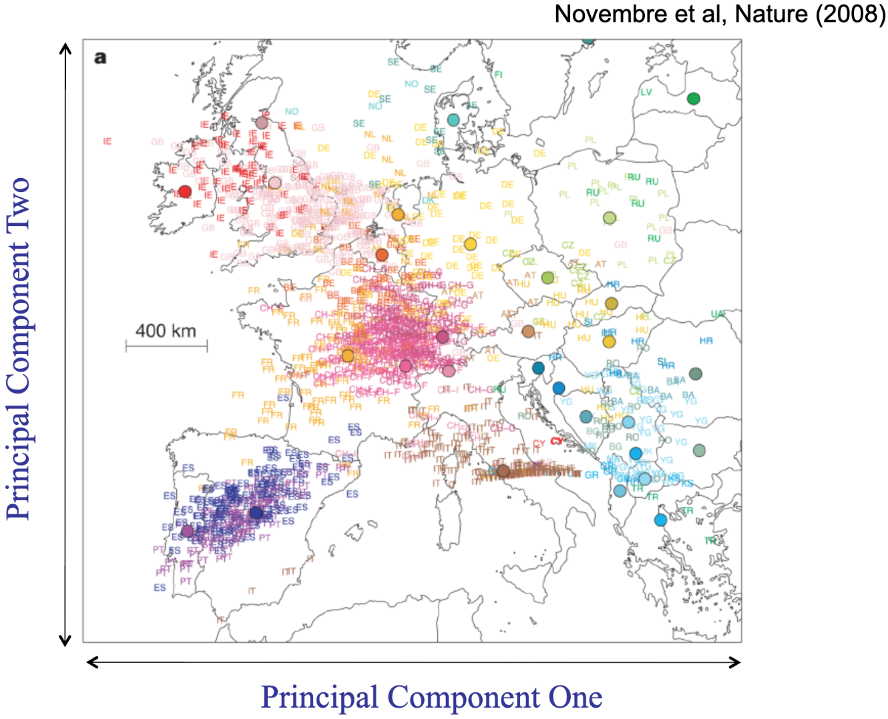

----------

title: 6.1 Population Genetics

----------

Two processes increase genetic diversity within a population. Mutation introduces novel variants into the population. Recombination re-shuffles the existing patterns of variation (what we call haplotypes). Both of these processes take place in every individual in every generation. Each of us carries hundreds of de novo (or new) mutations that we did not inherit from either of our parents. And each of us typically carries chromosomes that were not inherited intact from our parents, but instead, such as through a cross-over event, were newly formed from chromosomes that had been separated in our genetic parents.

The fate of new mutations is affected by random drift, selection, and population history. Although many think of selection as being the most powerful force acting on new mutations, whether positive (increasing the frequency of the mutation in the population over generations) or negative (decreasing the frequency of the mutation in the population over generations), selection can only occur if the mutation has a consistent impact on an outcome that changes reproductive success (that is, something to be selected for or against). The vast majority of mutations have no or negligible impact on anything (this must be true, otherwise those hundreds of new mutations we all carry would quickly make us so different we wouldn't be able to successfully reproduce at all). As a result, most mutations are neither selected for nor against. Sometimes, they may be located physically close on the ladder of DNA to a functionally important variant, so even mutations with no impact may still systematically increase or decrease in frequency along with that nearby functional or causal variant. But, absent this close physical link to a causal variation, nonfunctional mutations may persist, increase, or decrease in frequency over time largely as a function of randomness.

The extent to which any mutations that are physically close to one another on the ladder of DNA are expected to remain linked, or correlated, across generations is referred to as linkage disequilibrium (LD). Without the process of recombination, this LD would never be broken down and would extend a great distance along chromosomes. If Person 1 had Mutation A and Mutation B appear de novo on the same chromosome, and there was no recombination, all of Person 1s descendants would always carry both Mutation A and Mutation B. That is, the mutations would remain perfectly correlated or in strong LD; if we knew someone was a carrier of Mutation A, we would also know they were a carrier of Mutation B, even without genotyping them at the location of Mutation B. Recombination breaks down the correlation between mutations or variants over many successive generations, leaving a narrower window of correlation, or LD, over generations.

For an illustration of how LD between mutations breaks down over generations, see: [https://cjbattey.shinyapps.io/LDsim/](https://cjbattey.shinyapps.io/LDsim/)

It just so happens that mutation and recombination happen at fairly predictable rates, and so we can simulate how far patterns of LD should extend across the genome if only those two processes were at play and they played out fairly neutrally. When we compare that to the observed pattern of LD (see Figure below), we consistently observe that LD is stronger for longer distances of the genome than would be expected by chance alone. That suggests that one or more key assumptions (including neutral evolution - that is, no directional selection, homogeneous recombination - or recombination rates only being due to distance between mutations, and random mating) likely do not hold in the population we are examining (in this course, humans; but the same patterns is observed across species).

In human research, we usually don't focus as much on heterogeneous recombination or directional selection. Selection can really only be observed across generations, so isn't feasible for human researchers studying human participants (for this, we look to non-human animal research on organisms with shorter generations). Heterogeneous recombination is often attributable to physical characteristics of DNA (so generally stuff that's outside the focus of this course), such as the density of packing and folding structures that affect how likely any given segments of DNA are to get tangled. But it is important; very briefly, really important stuff - like the MHC, a gene-rich region on chromosome 6 that basically builds the immune system - are packed really tightly to avoid mutation and recombination, because it works well enough and messing up those core regions with random changes could be really bad, like non-viable-organism bad.

More relevant to how we think about LD in this course is the pattern of non-random mating. Although disassortative mating does occur (selection of reproductive partners based on having different characteristics; most notably in sexually reproducing species: different available sex cells), assortative mating (or reproducing with partners who are similar to ourselves) is a common process that plays out across generations and cultures, for both behavioral and non-behavioral characteristics.

We typically classify assortative mating under three processes. In primary assortative mating, mates choose each other intentionally based on their trait similarity (for example, "I play soccer, I want to raise my children as soccer players, I will only consider partnering with someone else who plays soccer"). Under social homogamy, mates choose each other due to proximity that happens because they have self-selected or have been selected into environmental proximity ("I might consider a non-soccer-playing partner, but I play and talk about soccer so much that I only ever meet other soccer players"). Under convergence, mates become more similar to each other over time ("At first I played soccer and my partner didn't, but now I've taught them to play soccer.") We tend to observe assortative mating across three broad domains: attractiveness (including height), moral attitudes (including religious and political attitudes), and cognitive ability (including educational attainment). For any of these domains (except the VERY SPECIFIC example of height), any one or more of the primary, homogamy, and convergence processes could be influencing the observed outcome of partners being more similar on the phenotype than expected by chance alone (again, except we do know that convergence can not explain why people tend to end up with similar-height others). We also know that assortative mating does not occur for certain other domains, including personality and mental health (the average correlation between partners on these phenotypes tends to be 0 - partners aren't likely to be systematically either similar or dissimilar to one another.)

But, beyond the individual differences that we tend to focus on when examining whether partners are more or less similar to one another is a factor that I know, for the overwhelming majority of all human mates (or, even beyond that, all mating pairs across all sexually reproducing species), is a similarity in their location in place and time. Until the relatively recent developments of long-distance travel and assisted reproductive technology (such as sperm and egg donation), our genetic ancestors were limited in mating options by one criterion first and foremost - were we in the same place, at the same time?

(After that, of course, the options could be narrowed down further; but same time + same place was the first criterion that applied to everyone.)

Throughout the overwhelming majority of the history of our species, our ability to travel has been limited and slow. So most humans were born and died in the same general geographic location as their ancestors going back hundreds or thousands of years. With limited movement across many generations, who do you end up mating with? Well, you don't get to choose from the entirety of the human population; you're limited to those around you, who have also been in the same place as their ancestors for a long time, over many generations mating only with people in the same place - there's a pretty good chance that your reproductive options were limited to people who were your relatively close cousins. Not necessarily your first cousins (although that is the route Charles Darwin took) but, commonly, people within a region or village would all end up being, genetically speaking, the equivalent of 3rd or 4th cousins. So, you're not mating with your 50th cousins, who are the humans on the other side of the globe, but with your **relatively** close genetic cousins. And the more closely related two people are, the more likely it is that they inherited some of those de novo mutations that popped up a few generations back in the same person/ancestor. And so the pattern of LD that we observe is stronger than expected - because we aren't recombining all available mutations across the entire population, we're limited to what exists in the surrounding area. And that process of essentially assortative mating for time and place leads to even neutral, nonfunctional mutations being shared more than expected by chance by people who are from the same genetic and, usually throughout history, social family tree. This non-random genetic similarity is the single largest signature in our genome when we look at the <1% of DNA that differs between people, and it's what we label "ancestry."

## Principal Components Analysis

The way we estimate ancestry in human genomics is often using a statistical procedure (not specific to genetics) called principal components analysis (PCA). PCA is applied to genotype data to describe continuous axes, or principal components (PCs), of genetic variation. The variables that emerge attempt to simplify a whole dataset of hundreds or thousands of participants, genotyped on thousands or millions of loci, into just a few variables (usually 20 - 100 components) that summarize how similar, or geometrically close, each participant is to each other participant. Each component "explains" as much of the genetic variation as possible, after accounting for the preceding components (so what we label PC1 summarizes the largest amount of genetic variation among the participants within the analyzed dataset, PC2 summarizes the next largest amount, and so on through however many PCs we've elected to estimate). PCs are used as covariates in analyses to attempt to statistically control for the non-random differences in mutations and LD between people. We take these PCs to have something to do with historical patterns of reproduction for two reasons. First, because theory suggests that these patterns (arising from the random mutations, plus nonrandom patterns of mating primarily for same-place-same-time) will be the largest effects observed in the human genome because selection/evolution is SLOW (requiring tens or hundreds of generations) compared to how quickly mutations are generated and passed down (every generation). Second, because when we've estimated these PCs for participants who are from locations where their ancestors have lived for hundreds or thousands of years, the PCs broadly map onto geographic variation. Below is one of the most well-known Figures in population genetics, from a paper demonstrating that the first two PCs estimated from genomes from European participants (each represented by a dot, color-coded based on the place the person lived, restricted to folks who identified all four grandparents as being from that same place) essentially recreates the East/West and North/South gradients when shown on top of a map of Europe.

Novembre et al 2008

--------

Next: [6.2. Scientific Racism](6.2_scientific_racism.md)

Previous: [6.0. Ancestry: What It Is and Isn't](6.0_ancestry_what_it_is_and_isnt.md)

Home: [Table of Contents](../README.md)
