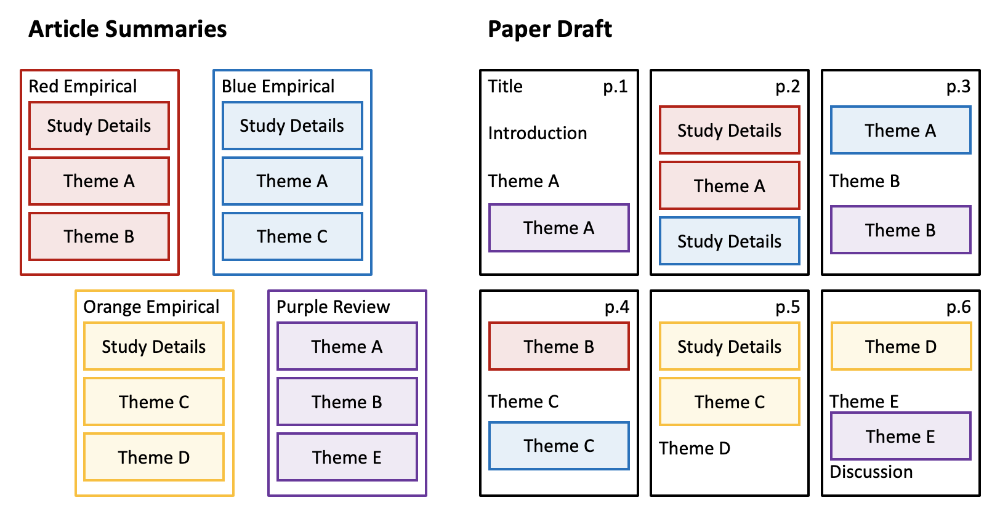

----------

title: Course Project Part 3, Draft Paper

----------

You are going to write a review-article-style summary of what you've learned about your Course Project topic from your 10 article summaries. You do not need to argue for a particular perspective or hypothesis so much as summarize what is known You should also close your paper with a discussion of what the current limitations of the research are, and what research you think should be done to improve our understanding of the topic.

Good writing comes from editing. But before you can edit, you must draft. The goal at this stage is to get words onto paper so that we can work together to make it better.

You will receive feedback on this draft from your instructor and your peers. Draft papers that (1) are shorter than 8 pages or (2) do not address course-relevant content (behavior genetics) or (3) are submitted late will not receive peer review.

Follow the Assignment Instructions below to take what you've already written for your 10 scholarly source summaries and turn those notes into a narrative review paper.

## Objectives

- Combine knowledge from across a variety of sources.
- Communicate information to a knowledgeable reviewer.

## Time Estimate

12 hours

## Assignment Instructions

The FINAL paper will be about 3,500 to 4,500 words (12 - 18 pages) plus 10-20 references; **your draft should be at least 8 pages of text** (assuming double-spaced 12pt Times New Roman or 11pt Arial, not including references). The more complete your draft, however, the more useful your peer review feedback will be and the less work you'll need to put in to produce the final version.

A suggestion for how to move from your 10 article summaries to a draft of your paper:

1. Looking across all 10 of your article summaries, make a list of what themes appear in which articles, looking especially for themes that show up in more than 1 article (see the left panel of the illustration below). Give each theme group a general but descriptive title (like, "Heritability", "Associated Genes", "Ethical Considerations", "Non-Human Animal Studies", "Developmental Effects", "Sex Differences", "Gene-Environment Interplay", "Overlap with Other Phenotypes"). Relevant themes/topics will vary, but whatever is useful for organizing the themes across the articles you've chosen.
2. For each empirical article summary, generate a brief paragraph-form summary of the study overall by combining information from the study specifics. For example, a basic template to get you started in many cases: "A {method} of {how many} participants found {primary finding} ({effect size}, {citation})."
3. Create an outline/framework for your draft paper by pasting your list of themes from step 1, so now each descriptive title is a heading for a topic section.
4. For each theme, paste sections how each relevant study (identified in step 1) relates to the theme (what you wrote for the "Explain how:" item for that theme on your article summary) from your article summary form into a paragraph under that theme's section in your paper draft document (see the right panel of the illustration below). For each empirical study, you should include the general study details the first time you introduce it to the reader; if you reference the same study again under later topics/themes, you can give a much briefer indication of which study you're talking about (for example, "This theme was also in the study by Derringer and colleagues (2017) discussed in the previous section, which found...").
5. Consider merging information from multiple articles into fewer paragraphs within a theme section. See the [Essay Structure Template](../materials/template_essay_structure.md) for examples of how to handle in-text parenthetical citations, whether there is only one source or multiple sources for a single paragraph.
6. Read your draft so far. Go back over your summaries to copy-and-paste any text you may not yet have included that seems relevant now that you have a general structure to your paper. Additional material from your summaries of any review papers often makes excellent introductions/conclusions/transitions between sections.
7. Before the first theme section, write an introduction: what is your topic, and why is it important?
8. After the last theme section, write a Discussion where you briefly summarize what your above-detailed description of the current literature shows, and what in your opinion would be the best recommended next steps for research on this topic to move forward.
9. Once you have this full rough first draft, edit. [Go through these tips for self-editing your writing.]()
10. If you notice while editing that one (or more) of your theme sections is a little sparse, find one or two more sources on that topic to fill out what you already have. In addition to searching for new articles through Google Scholar, you may want to review what folks posted as the Easiest and most Helpful articles in the discussion forum from Week 8, for some specific recommendations from your peers.

An illustration of the process to reorganize the writing you've done for your article summaries into a rough draft:

## Evaluation

10 points possible. See the Draft Paper Rubric below for how points will be assigned. 

| Criteria | High Quality = 100% | Mid Quality = 50% | Low Quality = 0% | Total Points Possible |
| --- | --- | --- | --- | --- |
| Topic Coverage | Provides broad coverage of a range of behavior genetic approaches to the topic, or in-depth coverage of a specific area/methods of genetic research on the topic. | Minimal or superficial coverage of topics or methods related to course themes. | Presented research is not clearly related to course themes (most often: paper seems to have been written for another course). | 3 points |
| Variety of References | Information comes from a variety of primary/empirical research reports. | Too few references (<10) or few-to-no primary/empirical articles cited. | Over-reliance on one or two existing review papers of the topic and/or excessive use of quotations (research findings not restated in student's own words). | 3 points |
| Organization | Provides a coherent/logical flow between topics. Includes some elements of synthesis or overall summary. | A mix of organized and disorganized (most often: the start is there, but not complete). | Information is presented as if in list format, with no transition or synthesis across information. | 2 points |
| Grammar | Easy to read, with APA formatted in-text and reference list citations. (Does not need to be free of minor grammar or spelling errors or in final/perfect APA format, as long as content is clear and citations are present and an attempt at APA format has been made.) | Some substantial errors in grammar or formatting (most common: several instances of whole sections or reports of studies missing citations completely). | Widespread grammar/spelling errors or sentence fragments make draft unreadable. | 2 points |

-----------

Next: [Draft Popular Source](4_draft_popular_source.md)

Previous: [10 Scholarly Source Summaries](2_10_scholarly_source_summaries.md)

Home: [Table of Contents](../README.md)
