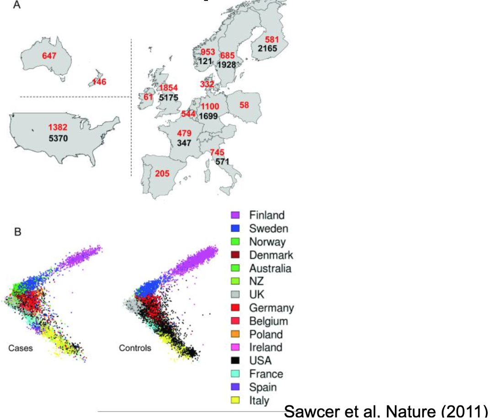
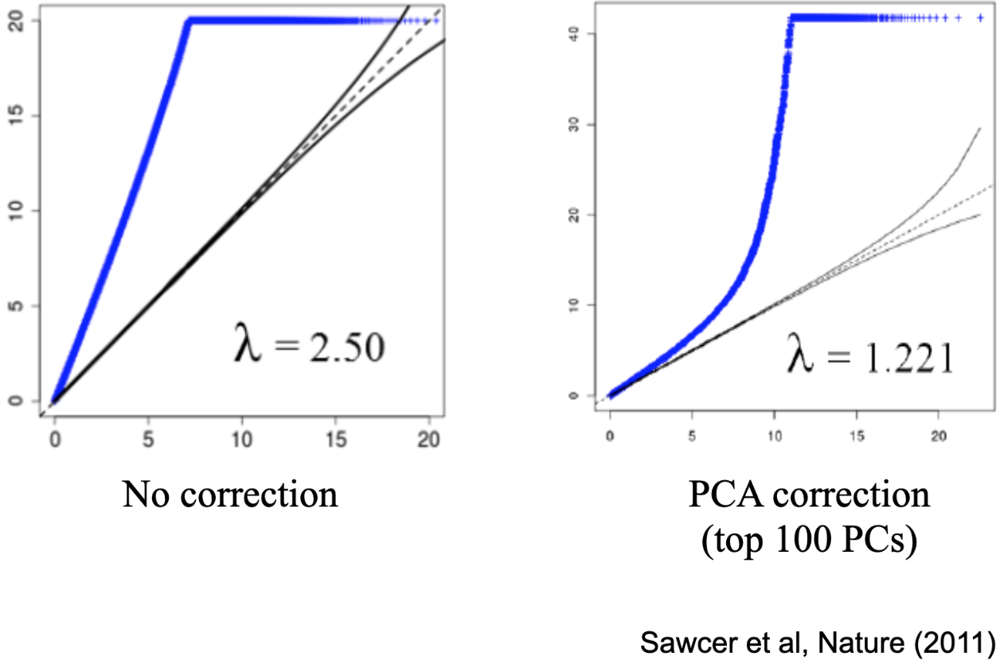

---

title: Scientific Racism

---

The genomic pattern we observe as ancestry, where genetic mutations track geographic locations, has been shown over and over across the world, wherever there is a substantial population that has been relatively stationary for hundreds or thousands of years. Genomic ancestry patterns don't just track geographic limitations on patterns of mating, however. If, for example, there exists a religion that for hundreds or thousands of years encourages its adherents to marry with other members of the same religion, you end up with similar patterns of distinguishing mutations popping up and being passed down within that lineage; this is how we can estimate genetic signatures of certain religious or cultural groups.

One example of genomic transmission running in parallel to cultural transmission resulting in culturally identified PCs is among Ashkenazi Jews. Because of a long-running cultural emphasis on within-religion marriage, if you are of Ashkenazi Jewish heritage (which I am), you and I are likely the genetic equivalent of third or fourth cousins, even if our social genealogies would not identify a specific common ancestor that recently (within the past 4 or 5 generations). It does NOT mean, however, that the ancestry-informative markers that the PCA process uses to cluster us together as genetically similar have any impact on our traits, and it certainly doesn't mean that there are any genes that make us Jewish. As an example, Judaism is traditionally considered to be transmitted through the mother's line, but I am only "genetically Jewish" on my father's side; following our culture's traditional rules, I am considered Jewish because my Scandinavian-ancestry mother converted to Judaism before I was born; personally, I identify as Jewish because I was raised in the traditions, had a bat mitzvah (I had a moon bounce at my party!), and care deeply about bagels and deli (the Jewish side of my family is from Hoboken, New Jersey - so place and culture are both confounded with ancestry for me). Genomic ancestry does not tell us about identity or experience - it is simply a statistical signal that arises from who your genetic ancestors were (and even then, not all of them; the way probability works - you only get 50% of DNA from each genetic parent - means that many of your ancestors, especially several generations back, may not be directly represented in your DNA at all).

Unfortunately for our ability to figure out "what genes do", genes are constantly, for most people throughout most of human history, passed down within families in a very similar pattern to how culture, or environmental exposures, or resource availability may track over time. And these spurious associations between background ancestry and environmental outcomes can arise even over a short period of time. For example, suppose it were suddenly decreed that all Icelanders must wear tophats. The policy takes effect on Jan 1. On Jan 2, you collect data from all over the world on tophat-wearing, along with DNA. You would find that the mutations that happen to appear among Icelanders more than among other ancestries are strongly correlated with tophat-wearing. But if you 'controlled for' (Icelandic and other) ancestry by including principal components as covariates in your statistical analysis, those correlations between genetic variants and tophat-wearing would disappear. The problem is because these spurious correlations between ancestry and environment *can* occur quickly, it means that to fully account for them we must be certain that we are accounting for even relatively recent (that is, single generation) passing of novel mutations. Practically speaking, we cannot collect enough data (either in quantity or detail) from among putatively unrelated folks to estimated ancestry at this necessary level of detail. For this, we must use what is currently considered the gold standard for statistical control for background ancestry, which is to examine effects only among participants from the same family (that is, siblings). Because it is much more difficult to collect family data than to just include all available participants, most studies seeking to identify genetic associations with any phenotype are still subject to the potential confounding effect of ancestry - it is incredibly difficult to rule out parallel environmental effects as an explanation (that is, this is a form of gene-environment correlation).

The Figures below show a real-world example of what happens when you fail to account for genomic ancestry in a situation where the outcome is confounded (or correlated for artificial, not causal, reasons) with genomic ancestry. The Figure below this paragraph illustrates a study interested in identifying genetic variants associated with Multiple Sclerosis (MS). However, the available sample was not a random or representative sample (it never is). Panel A shows the number of cases (folks with MS, in red text) and controls (folks without MS, in black text) included in the study broken down by each country of origin. As you can see, the numbers aren't similar proportions from each country: some contributed only cases, while others contributed substantially more controls than cases. Panel B shows the plot of the first two principal components for all the participants (1) split by case-control status and (2) color-coded by country of origin. As you can see, (1) the countries differ in terms of their average PCs (participants labeled with the same color tend to cluster together), and (2) the distribution of colors (representing countries) differs between the case and control groups. This sampling scheme has created a confound - or an unintended nuisance correlation - between ancestry and MS case-control status.

The Figure below this paragraph shows one of the common ways (called a 'Q-Q plot') that we summarize the results of the millions of tests that are done in a genome-wide association study (GWAS, pronounced "gee-WAHs") when we check each available genotyped single nucleotide polymorphism (SNP, pronounced "snip") for correlation with a phenotype of interest. When so many tests are done, there will be some very low p-values (how we tend to evaluate statistical significance) by chance alone. To take that into account, we can compare our observed distribution of p-values (the values used to array points - each of which represents the result of one tested SNP - along the vertical y-axis) to the distribution of p-values that would be expected by chance alone (that's the values used to array points along the horizontal x-axis). The dotted black line running along the diagonal is where we would expect the points to fall if there were no effects (that is if the observed distribution and the expected distribution were the same). Points falling above the line indicate more SNPs with lower p-values than would be expected by chance alone. The plot to the left, labeled 'No correction', shows the result of the GWAS of MS when the PCs are NOT included as a covariate. That is, it looks like ALL the SNPs have lower p-values than expected by chance, and so we might conclude that ALL the SNPs are associated with MS. This divergence is summarized by the lambda coefficient: here it's 2.5, which is HUGE. Once the top 100 PCs are included as covariates (the results shown in the right-side plot), however, it drops to 1.221 (values closer to 1 are considered less likely to reflect substantial stratification). There are still a lot of SNPs more strongly associated with MS than would be expected by chance alone (MS is heritable and polygenic - many genes, not just one), but there's also some SNPs (densely plotted in that bottom left corner, it's actually MOST of the SNPs) that are unrelated to MS status.

The subtleties that arise from the often co-occurrence of genetic transmission and exposure to experiences are subtle yet pervasive. Realistically, most people are not super excited about understanding the technical limitations and interpretations of this genetic ancestry thing. It is easy to misunderstand or to intentionally misrepresent, and the consequences of such can be dire, either in terms of encouraging folks to wrongly conclude that there are substantial genetic differences between geographic, cultural, or ethnic groups; that groupings we perceive or enact are "real" or distinct (we never observe categorical grouping among participants; genetic distribution is a continuous swath that stretches across all of humanity at as fine-grained a level of measurement as we can undertake); or that associations between genes and behavior (or other traits) necessarily mean that genes are the cause of the outcome. We often assume that genetic associations must be causal (even though by association I mean correlation and correlations are not sufficient to prove causation) because genes came first. But, for most of us, our genes didn't come first, or come together randomly - they came from our social parents, who provide both genes and environments, and who did not end up mixing their genetic material randomly. And for that reason, observing that a genetic variant is associated with a phenotype in a general population sample is only the first step to understanding how or why that association has occurred - and it's absolutely not necessarily because the gene is the cause.

-----

Home: [Table of Contents](../README.md)
