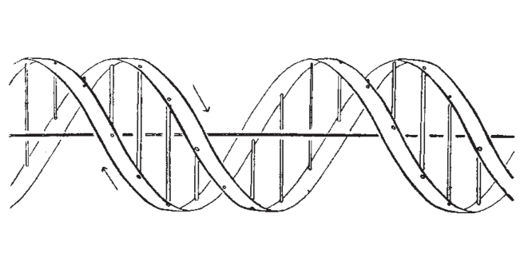

---

title: Activity, Design Your Own Gene

---

Eagle-eyed lecture attendees may have noticed that I have a [forearm tattoo](../img/jd_dna_tattoo.jpg) of a DNA double helix made out of prairie flowers. For this activity, you're going to design your own.

## Step 1 of 2

Design your own "gene" by coloring in Watson & Crick's (1953) original diagram. You can color it digitally or print it out, color it, and take a picture. (On most systems you can download the image by right-clicking on it and selecting Download Image or Save Image As.) You can color in the lines, or scribble angrily, or turn it into a roller skating bear; whatever strikes you. 

## Step 2 of 2

Answer the following 2 questions

1. What is it the gene for?

2. In 100-200 words drawing on concepts from the course, why is (1) the wrong question to ask?

--------

Home: [Table of Contents](../README.md)
